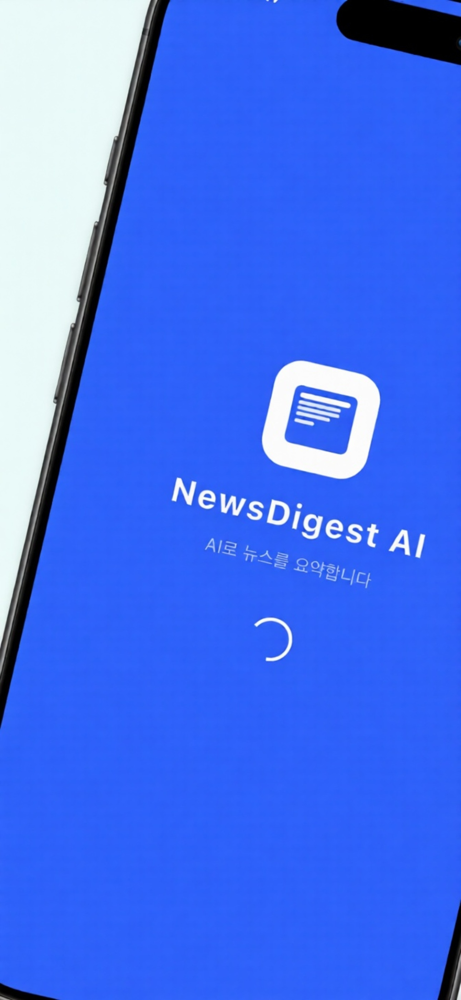
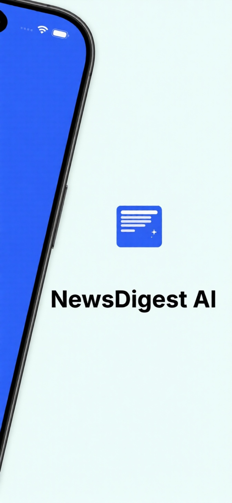
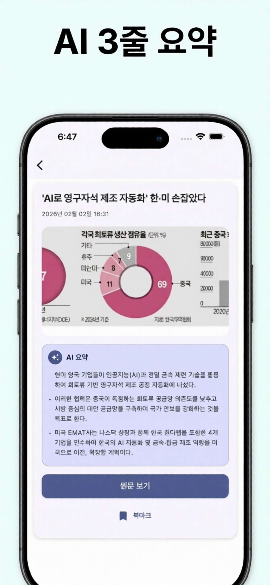
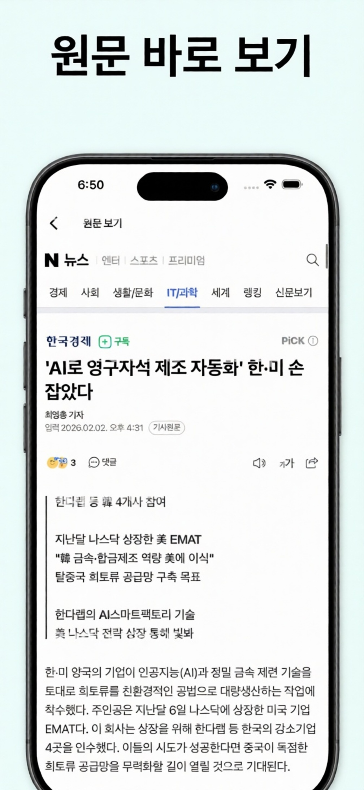
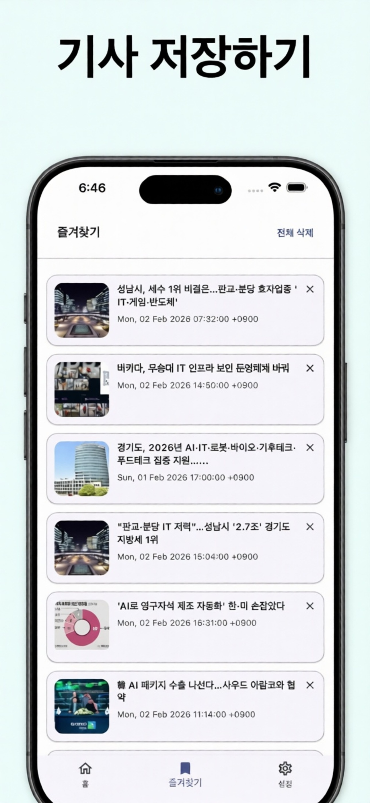
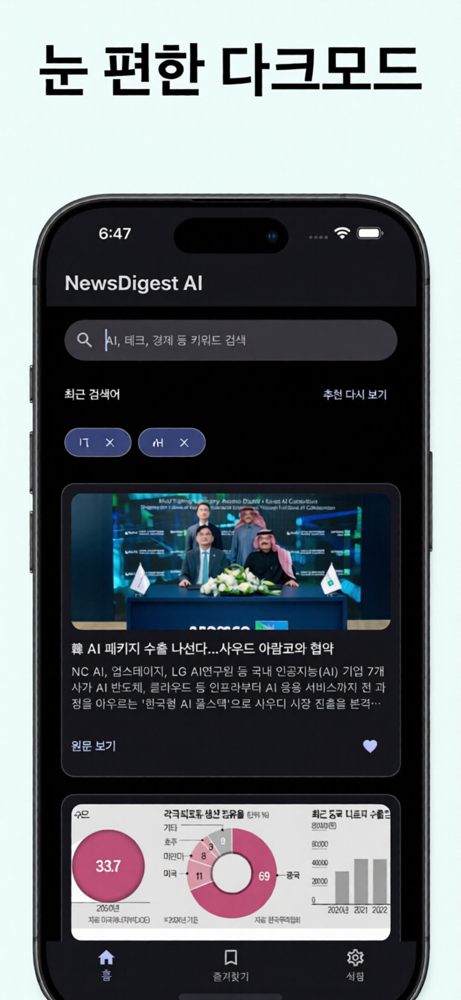
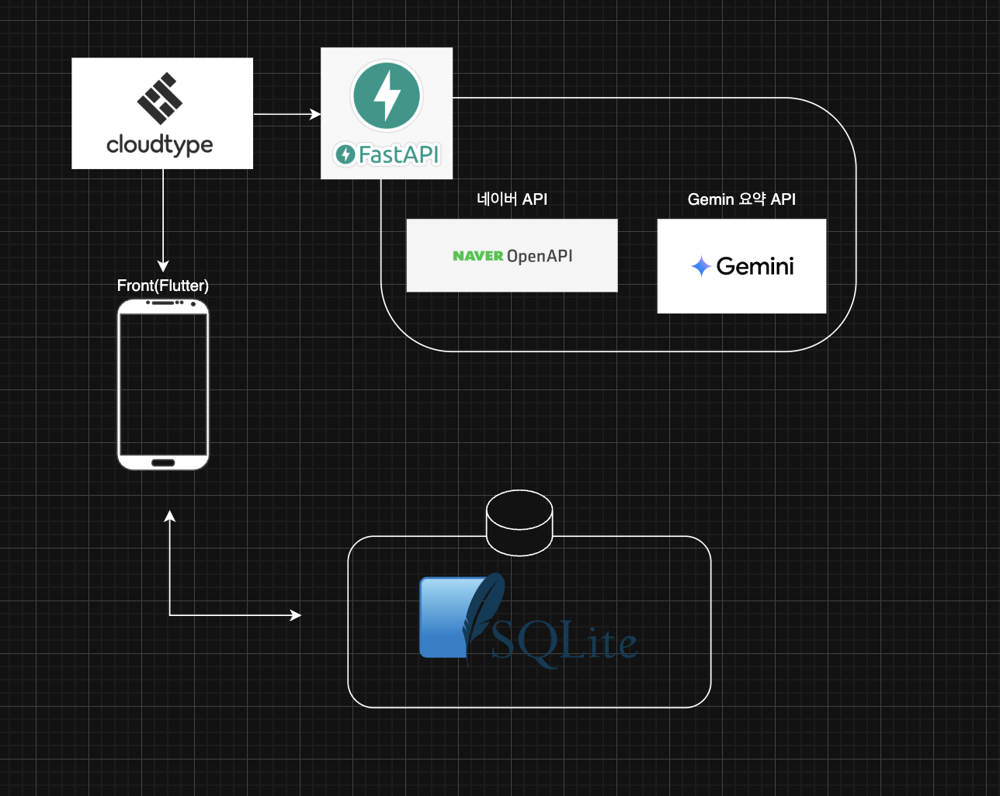

<p align="center">
    
</p>

<div align="center">
  📰 뉴스 핵심을 3줄로 요약하는 AI 뉴스 앱
  <br/>
  <b>NewsDigest AI</b>
  <br/>
  <a href="https://alabaster-chocolate-fe8.notion.site/NewsDigest-AI-2f4b5e94906580ec8ef2f906bcaa5d00?source=copy_link">Privacy Policy</a> ·
  <a href="https://alabaster-chocolate-fe8.notion.site/NewsDigest-AI-2f4b5e94906580699c3acc5295ee3a8d">Terms</a>
</div>

<br/>

# 🙌 프로젝트 소개
NewsDigest AI는 긴 뉴스를 읽지 않아도 핵심만 빠르게 파악할 수 있도록 돕는 모바일 앱입니다.
AI 요약, 키워드 검색, 즐겨찾기, 다크모드를 통해 뉴스 탐색을 빠르고 편하게 만듭니다.

<br/>

<p align="center">
  
  
  
  
  
  
  
</p>

<br/>

# ✨ 주요 기능
- **AI Summary**: 뉴스 핵심 3줄 요약
- **Smart Search**: 키워드 기반 뉴스 검색
- **Bookmark**: 기사 저장 및 관리
- **Dark Mode**: 야간 환경 최적화 UI

<br/>

# 🛠 기술 스택
- **Flutter** / Dart
- **Riverpod** (상태 관리)
- **SQLite** (로컬 저장)
- **WebView** (원문 보기)

<br/>

# 🧱 아키텍처
<p align="center">
  
</p>

---

## 🤖 AI Summary Flow

User Input  
→ News Search API  
→ Article Detail Fetch  
→ Summarization API  
→ 3-Line Result  
→ Local Cache (SQLite)

<br/>

# 🚀 배포 (GitHub Actions)
`main` 브랜치에 push 시 Android AAB 빌드가 자동으로 실행됩니다.
Workflow: `.github/workflows/main.yaml`

- Flutter 버전: **3.24.5**
- 산출물: AAB (Artifacts로 업로드)

<br/>

# 🎬 데모 영상

<p align="center">
  <a href="https://youtu.be/PN2NPfdw-eQ">
    
  </a>
  <br/>
  <b>▶ 클릭하면 YouTube에서 재생됩니다</b>
</p>

<br/>

# 🏪 스토어 링크
<p align="center">
  📲 지금 바로 다운로드하세요
</p>

<p align="center">
  <a href="https://play.google.com/store/apps/details?id=com.harukax99.newsdigestai">
    
  </a>

  <a href="https://apps.apple.com/kr/app/newsdigest-ai/id6758535433">
    
  </a>
</p>

<br/>

# 📱 실행 방법
```bash
# 의존성 설치
flutter pub get

# 실행
flutter run
```

<br/>

<br/>

# 👨‍💻 개발자
- 하동훈
- 문의: newdigestai@gmail.com
